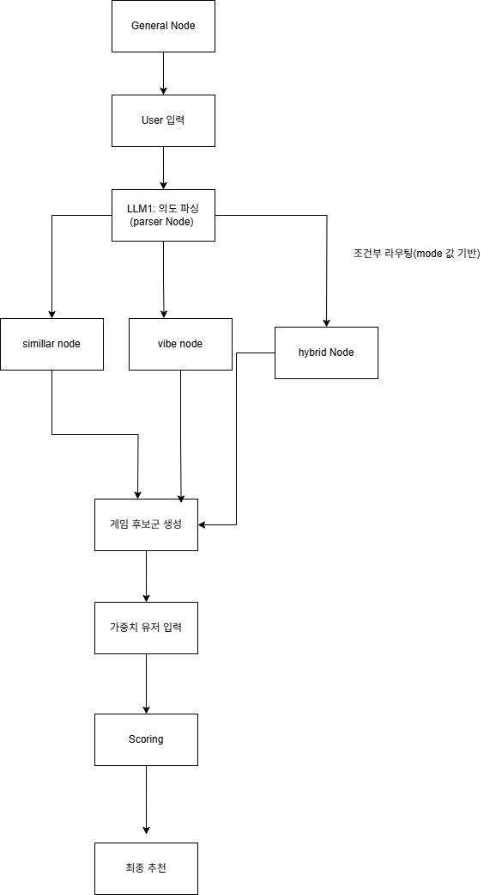

## LLM

최대한 노션에 있는대로 구현하였습니다. 데이터 파일명 또한 노션에 있는 걸 그대로 사용하였습니다.

### 실행방법

requirements.txt에 있는 패키지들을 모두 다운로드 해주세요.

그 후 streamlit run st_app/app.py를 터미널에 입력합니다.

### 파일 설명

general_node.py : 기본 채팅 노드

parser_node.py : JSON 파싱 노드

recommendation_nodes.py: Vibe, Hybrid, 

router_node.py: 조건부 라우팅

### 전체 파이프라인

 최종 파이프라인:

   1. UI: 사용자가 질문과 함께 재정렬 가중치를 설정합니다.
   2. 파서: LLM이 질문을 분석해 JSON으로 변환합니다.
   3. 라우터: JSON의 mode에 따라 similar, vibe, hybrid 노드로 작업을 분기합니다.
   4. 후보군 검색: 각 모드별 로직으로 FAISS에서 Top 200 게임을 검색합니다.
   5. 재정렬: rerank_node가 가중치를 적용해 Top 5 게임을 선정하고 상세 데이터를 다음 노드로 넘깁니다.
   6. 응답 생성: response_generator_node가 최종 후보 게임 데이터와 사용자 질문을 바탕으로, 제시해주신 핵심 규칙에 맞춰 자연스러운 추천사를 생성합니다.
   7. 출력: 생성된 추천사를 사용자에게 보여줍니다.

### Scoring

가중치: 현재는 유저가 직접 입력

Tagmatch : 코사인 유사도 기반 점수 (0~1) : 비슷할수록 점수 높음
Novelty : 코사인 유사도 기반 점수(0~1) : 비슷할수록 점수 낮음

### Update

문자열 파싱 개선

### 앞으로 해야할 것들

games 추가 크롤링 (판매량, 출시일 있어야함..!)
Scoring 개선
데이터베이스 업로드 (st_app/data 에)
테스트
실행방법 추가

